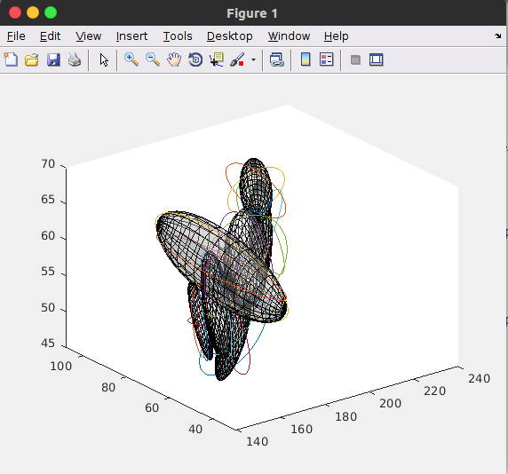
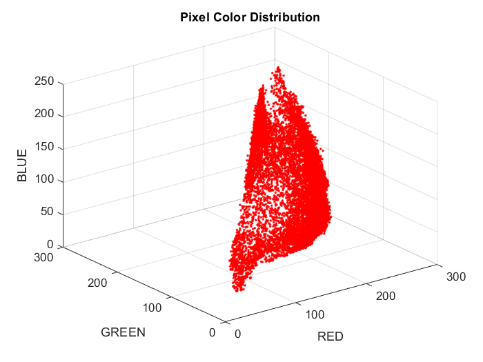

## Vision Projects:

1. **Structure from Motion**:

2. **SnapCut- segmenting deformable objects**

[Description and paper](https://research.adobe.com/project/snapcut/)

3. **Panorama Stiching**

4. **GMM - Gaussian Mixture Model segmentation**

